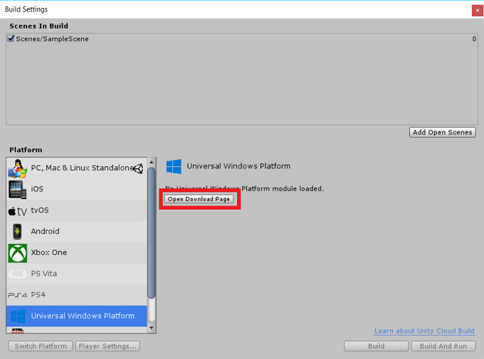
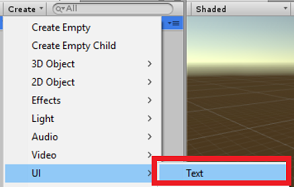

# Demo 1 - Holo World

This demo shows how to overlay text in the augmented reality camera running in the Unity Emulator.

## Setup Instructions

Follow these instructions to deploy and run the application in the emulator:

1. Create Unity project
   - open **Unity** (Note: in your download folder, double-click **Unity/Editor/Unity.exe**
   - click **Projects** > **New**

   

   - for **Project name** type **HoloWorld**
   - for **Location** type **`<working-dir>`**
   - for **Template** select **3D** (Note: the default)
   - click **Create project**
1. Configure platform
   - menu **File** > **Build Settings...**

   

   - select **Universal Windows Platform**
   - click **Open Download page**
   - save the installer executable to `<working-dir>`
   - close **Unity**
   - double click the installer executable
   - click **Next** > accept the terms of service > click **Next** > **Next**, select the download folder, click **Next** > **Finish**
1. Configure Vuforia
   - start **Unity**
   - click **Projects** > **HoloWorld**
   - menu **File** > **Build Settings...**

   

   - select **Universal Windows Platform**
   - click **Switch Platform**
   - select **HoloLens** for **Target Device**

   

   - click **Player Settings...**
   - click **Other Settings**
   - select **.NET** for **Scripting Backend**

   

   - click **Publishing Settings**
   - for **Capabilities** check **InternetClient**, **WebCam**, and **Microphone**

   

   - click **XR Settings**
   - check **Virtual Reality Supported**
   - click **Vuforia Augmented Reality**
   - save the installer executable to `<working-dir>`
   - close **Unity**
   - double click the installer executable
   - click **Next** > accept the terms of service > click **Next** > **Next**, select the download folder, click **Next** > **Finish**
   - start **Unity**
   - click **Projects** > **HoloWorld**
   - menu **File** > **Build Settings...**

   

   - click **Player Settings...**
   - click **XR Settings**
   - check **Vuforia Augmented Reality**, accept the conditions, click **Finish**
1. Create UI"

   

   - select: **MainCamera** and **Directional Light** (Note: Hold down Ctrl key for multi-select)
   - right click: select **Delete**
   - right click **Directional Light** > **Delete**

   

   - click menu option **GameObject** > **Vuforia** > **AR Camera**
   - click **Import**

   

   - select **SampleScene**
   - click **Create** > **UI** > **Text**

   

   - set **Text** to **Holo World!**
   - set **Font Size** to **24**

   

   - set **Color** to **white** (Note: set **R**, **G**, and **B** to **255**)
   - menu **File** > **Save Scenes**
   - menu **File** > **Save Project**

## Run the demo

   

   - click **Run**. You will see a live camera view overlayed with the words "Holo World!"
