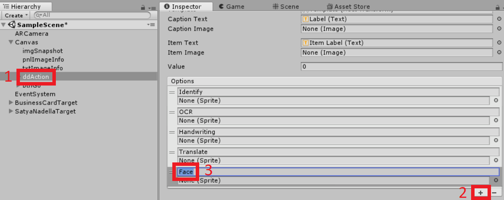

# Demo Eight - FacialRecognition

This demo builds upon the previous demo by showing how to call the Faces API on a device camera picture and display facial characteristics such as age, gender, and emotion. When running, it looks like this:


## Setup Instructions

Follow these instructions to deploy the application when using the emulator:

1. Add option

   - Select **ddAction**
   - Add a **Face** option

   

1. Add scripts

   - Copy **`<working-dir>`\reality-augmentation-using-cognitive-services\08-FacialRecognition\scripts\FacesAPIResults.cs** to **`<working-dir>`\HoloWorld\Assets\Scripts**

1. Edit scripts

   - Edit **`<working-dir>`\HoloWorld\Assets\Scripts\VisionAPIUtils.cs** by adding these consts at the top:
   ```
   const string FACES_API_SUBSCRIPTION_KEY = "YOUR_SUBSCRIPTION_KEY";
   const string FACES_API_BASE_URL = "YOUR_BASE_URL";
   ```
   - Replace **YOUR_SUBSCRIPTION_KEY** with your Faces API subscription key
   - Replace **YOUR_BASE_URL** with your Faces API base URL
   - Edit **`<working-dir>`\HoloWorld\Assets\Scripts\VisionAPIUtils.cs** by adding a new function called **MakeFaceRequest** at the bottom of the VisionAPIUtils class:
   ```
    public static IEnumerator MakeFaceRequest(byte[] bytes, string textComponent, Type type)
    {
        var headers = new Dictionary<string, string>() {
            {"Ocp-Apim-Subscription-Key", FACES_API_SUBSCRIPTION_KEY },
            {"Content-Type","application/octet-stream"}
        };
        string requestParameters = "returnFaceAttributes=age,gender,emotion";
        string uri = FACES_API_BASE_URL + "/detect?" + requestParameters;
		if ( (bytes != null) && (bytes.Length > 0) ) {
			WWW www = new WWW(uri, bytes, headers);
			yield return www;

			if (www.error != null)
			{
				TextUtils.setText(www.error, textComponent, type);
			}
			else
			{
				string json = www.text.TrimStart('[').TrimEnd(']');
				FacesAPIResults results = JsonUtility.FromJson<FacesAPIResults>(json);
				TextUtils.setText(results.ToString(), textComponent, type);
			}
		}
    }
   ```
   - Edit **`<working-dir>`\HoloWorld\assets\Scripts\SetImageLabels.cs** by adding a new case statement that calls **MakeFaceRequest** as follows:
   ```
	case 4: // Face
		StartCoroutine(VisionAPIUtils.MakeFaceRequest(bytes, "txtImageInfo", typeof(Text)));
		break;
   ```
   - Menu **File** > **Save All**

   - From the Unity Editor
   - Menu **File** > **Save Scenes**
   - Menu **File** > **Save Project**   

## Run the demo

  

  - Click **Run**. If you position someone in front of your devices's camera, select **Face**, and click the **Go** button, you will see facial characteristics of that person including age, gender, and emotion.
